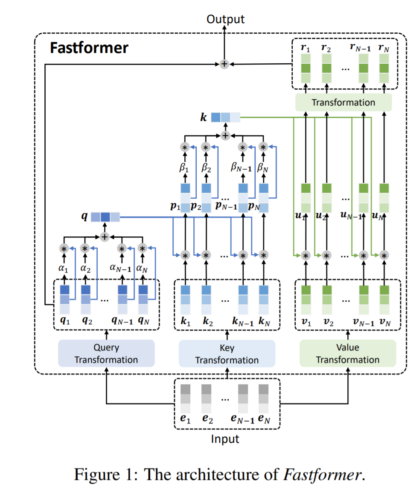

# Fast Transformer 

This repo implements [Fastformer: Additive Attention Can Be All You Need](https://arxiv.org/abs/2108.09084) by Wu et al. in 
TensorFlow. **Fast Transformer** is a Transformer variant based on additive attention that can handle long sequences 
efficiently with linear complexity. Fastformer is much more efficient than many existing Transformer models and can 
meanwhile achieve comparable or even better long text modeling performance.

